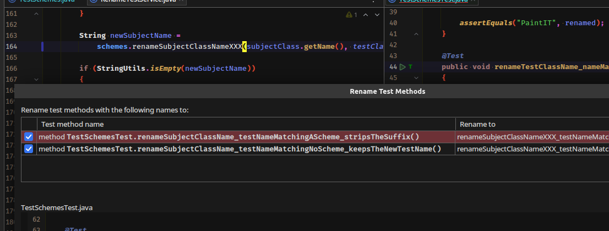
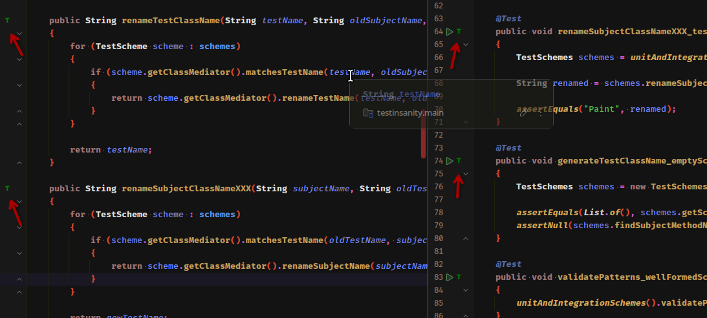
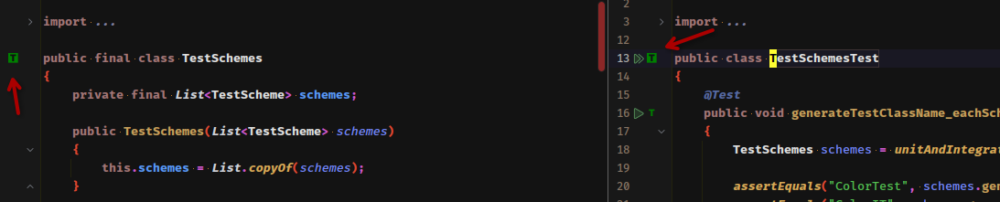
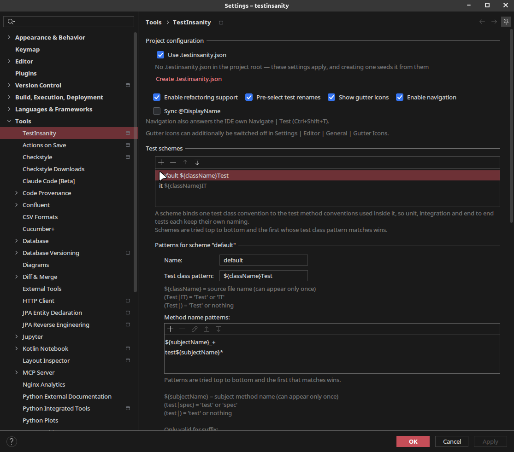
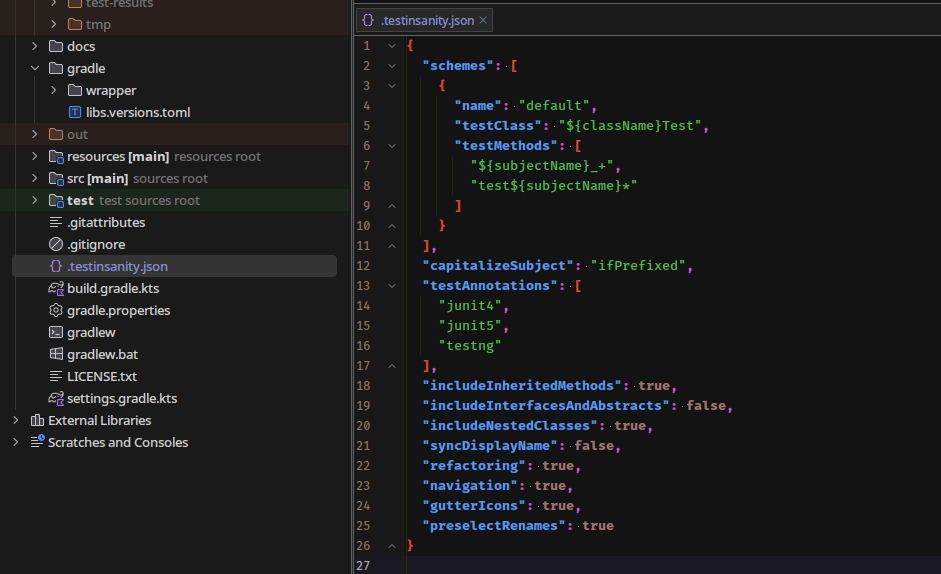
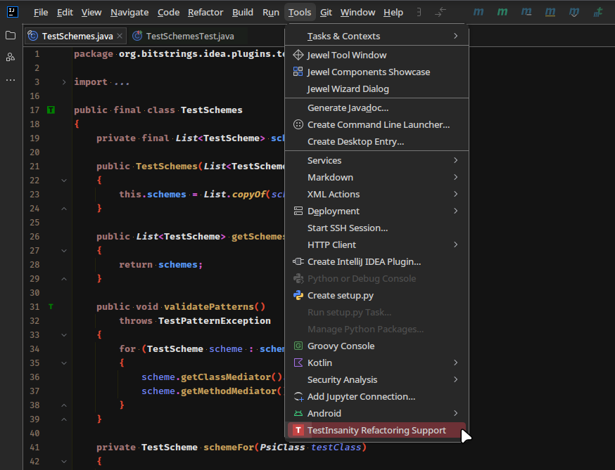

# TestInsanity

Navigate and rename between your code and its tests in IntelliJ IDEA.
JUnit 5, JUnit 4 and TestNG. Java and Kotlin.

**[Install from the JetBrains Marketplace](https://plugins.jetbrains.com/plugin/13860-testinsanity)**

Rename a class and its test classes are renamed with it. Rename a method and its test methods follow.
Jump straight from a method to the test method that covers it.

## It follows your convention

Navigate → Test guesses one class name and stops at the class. TestInsanity uses the convention you
declare, and matches methods too.

| Pattern | Maps |
| --- | --- |
| `${className}Test` | `Color` → `ColorTest` |
| `test${subjectName}*` | `isDarkColor()` → `testIsDarkColor_whenBlack()` |

Nothing to configure to start: unit tests match `${className}Test`, integration tests match
`${className}IT`.

## In the gutter

Every method links to the method that tests it.

Every class links to its test class, and a test with no subject gets an icon of its own.

`Alt+Enter` writes whatever is missing — the test class, the test method with the right annotation, or
the subject class if you started from the test.

## Schemes

A scheme binds one test class convention to the method conventions used inside it. Schemes are tried top
to bottom and the first whose class pattern matches wins, so unit, integration and end to end tests each
keep their own naming.

## Share it with your team

Put a `.testinsanity.json` in the project root and everyone gets the same schemes, the way
`.editorconfig` does. It has completion and validation as you type, and one click in the settings writes
it from the settings you already have.

What the file declares governs the project and shows as disabled in the settings. What it omits stays a
personal preference.

## Switching it off

Renaming toggles from the Tools menu, without opening the settings.

---

[Report an issue](https://github.com/bitstrings/testinsanity/issues) · Apache License 2.0
